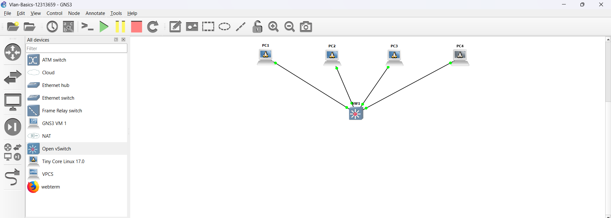
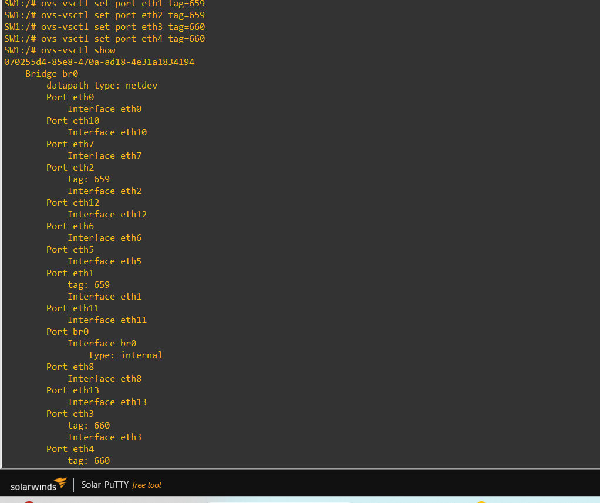
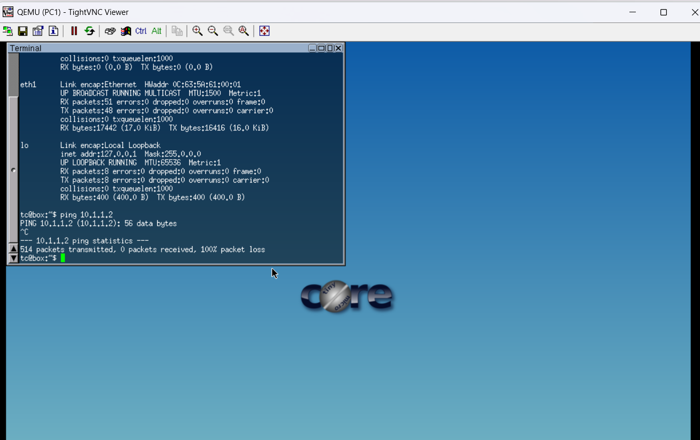
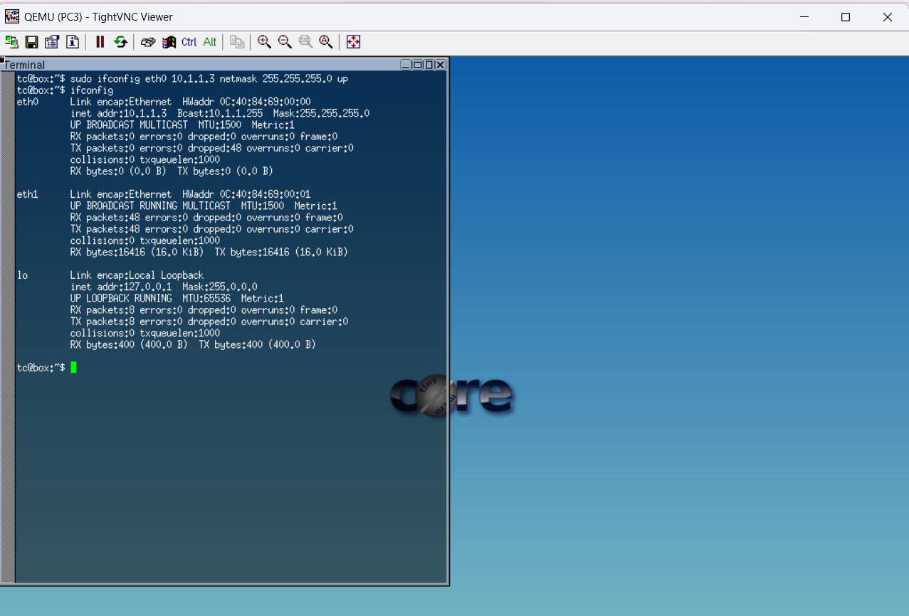
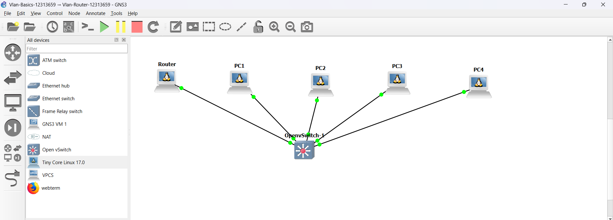

# Week 05 Tutorial 

## Student Details
- Name: Thrinadh  
- Student ID: 12313659  

---
# Task 1: VLAN Configuration using Open vSwitch

## Aim
To configure VLANs on an Open vSwitch and verify network segmentation by testing communication between hosts.

---

## Network Topology
The network consists of four PCs connected to a single Open vSwitch.



---

## IP Configuration

Each PC was assigned an IP address in the same subnet.

| PC  | IP Address   | Subnet Mask     |
|-----|-------------|-----------------|
| PC1 | 10.1.1.1    | 255.255.255.0   |
| PC2 | 10.1.1.2    | 255.255.255.0   |
| PC3 | 10.1.1.3    | 255.255.255.0   |
| PC4 | 10.1.1.4    | 255.255.255.0   |

### Commands Used
```bash
sudo ifconfig eth0 10.1.1.1 netmask 255.255.255.0 up
sudo ifconfig eth0 10.1.1.2 netmask 255.255.255.0 up
sudo ifconfig eth0 10.1.1.3 netmask 255.255.255.0 up
sudo ifconfig eth0 10.1.1.4 netmask 255.255.255.0 up
```

---

## VLAN Configuration

Based on the setup:

- VLAN 659 → PC1, PC2  
- VLAN 660 → PC3, PC4  

### Commands Executed on Switch
```bash
ovs-vsctl set port eth1 tag=659
ovs-vsctl set port eth2 tag=659
ovs-vsctl set port eth3 tag=660
ovs-vsctl set port eth4 tag=660
```

---

## VLAN Verification

### Command
```bash
ovs-vsctl show
```

### Output Screenshot


### Observation
- eth1 and eth2 are assigned to VLAN 659  
- eth3 and eth4 are assigned to VLAN 660  

---

## Connectivity Testing

### Test 1: Same VLAN Communication

Test between PC1 and PC2.



**Result:**  
Communication should be successful within the same VLAN.

---

### Test 2: Different VLAN Communication

Test between PC1 and PC3.



**Result:**  
Communication failed (100% packet loss), showing VLAN isolation.

---

## Analysis
The VLAN configuration successfully separated the network into two logical groups. Even though all PCs are connected to the same physical switch and share the same subnet, communication is restricted based on VLAN membership.

- Same VLAN → Communication allowed  
- Different VLAN → Communication blocked  

This demonstrates proper VLAN segmentation and traffic isolation.

---
# Task 2: Setup VLANs on a Router

## Aim
The aim of this task is to configure VLANs on a managed switch and enable inter-VLAN communication using a router.

---

## Network Topology

The network consists of:
- 4 Linux hosts (PC1, PC2, PC3, PC4)
- 1 OpenvSwitch (Layer 2 switch)
- 1 Linux Router (Layer 3 device)

The router is connected to the switch using a trunk link, while all PCs are connected to access ports.

### Screenshot:


---

## IP Addressing Scheme

| Device | VLAN | IP Address | Subnet |
|--------|------|------------|--------|
| PC1    | 659  | 10.1.1.1   | 255.255.255.0 |
| PC2    | 659  | 10.1.1.2   | 255.255.255.0 |
| PC3    | 660  | 10.1.2.1   | 255.255.255.0 |
| PC4    | 660  | 10.1.2.2   | 255.255.255.0 |
| Router (VLAN 659) | 659 | 10.1.1.254 | 255.255.255.0 |
| Router (VLAN 660) | 660 | 10.1.2.254 | 255.255.255.0 |

---

## Switch Configuration

The OpenvSwitch is configured with VLAN tagging on access ports and trunking on the router port.

### Commands Used:
```bash
ovs-vsctl set port eth1 tag=659
ovs-vsctl set port eth2 tag=659
ovs-vsctl set port eth3 tag=660
ovs-vsctl set port eth4 tag=660
ovs-vsctl set port eth0 trunks=659,660
```

### Explanation:
- Ports eth1 and eth2 belong to VLAN 659
- Ports eth3 and eth4 belong to VLAN 660
- Port eth0 acts as a trunk port connecting the router


---

## Router Configuration

A single physical interface (eth0) is used with VLAN sub-interfaces.

### Commands Used:
```bash
tce-load -wi vlan

sudo vconfig add eth0 659
sudo vconfig add eth0 660

sudo ifconfig eth0.659 10.1.1.254 netmask 255.255.255.0 up
sudo ifconfig eth0.660 10.1.2.254 netmask 255.255.255.0 up

sudo ifconfig eth0 up

sudo sh -c "echo 1 > /proc/sys/net/ipv4/ip_forward"
```

### Explanation:
- VLAN interfaces eth0.659 and eth0.660 are created
- Each VLAN is assigned a gateway IP
- IP forwarding is enabled for routing

---

## Connectivity Testing

### Same VLAN Test
- PC1 → PC2: Successful
- PC3 → PC4: Successful

### Inter-VLAN Test
- PC1 → PC3: Successful
- PC2 → PC4: Successful

This confirms that routing between VLANs is working correctly.
 

---

## Result

The VLANs were successfully configured on the switch, and inter-VLAN communication was enabled using the router. Devices in different VLANs were able to communicate through the router, demonstrating proper Layer 3 routing functionality.

---

## Conclusion

This task demonstrated how VLAN segmentation improves network organization and security while maintaining communication through routing. The use of a trunk link and VLAN sub-interfaces allowed efficient inter-VLAN communication using a single physical interface on the router.
## Conclusion
VLANs were successfully implemented using Open vSwitch. PCs in VLAN 659 communicated with each other, and PCs in VLAN 660 communicated with each other. However, communication between VLANs was not possible, confirming correct VLAN configuration and network segmentation.

---
 
