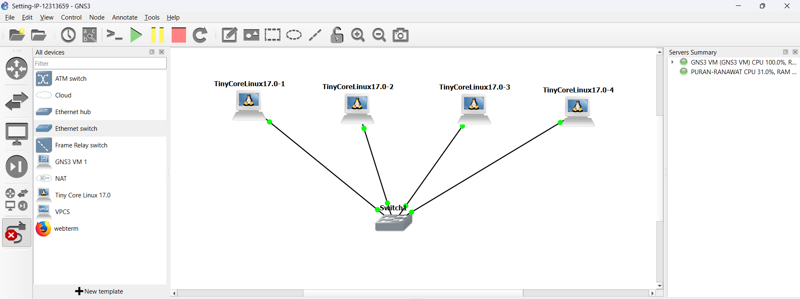
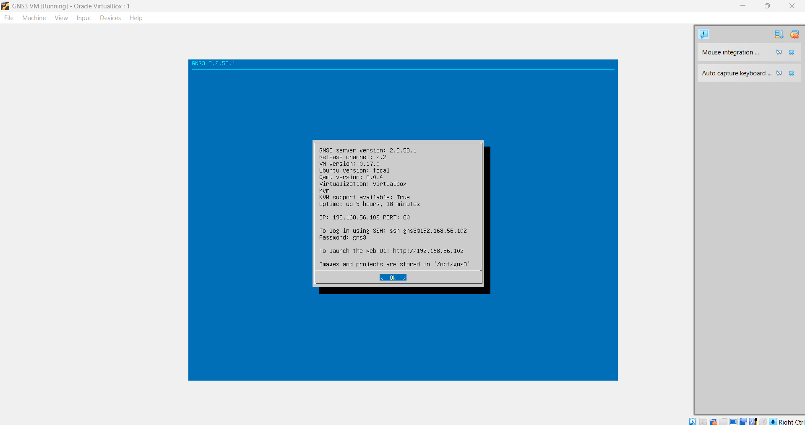
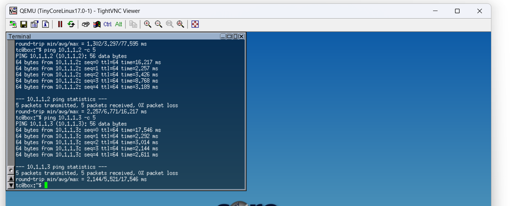

# Week 02 – Network Configuration and Connectivity using GNS3

## Student Name: Thrinadh

## Student ID: 12313659

---

# 1. Introduction

In this task, a local area network (LAN) was designed and implemented using GNS3. The objective was to configure multiple Linux-based end devices and establish successful communication between them. Tiny Core Linux was used as the host operating system for all nodes, and an Ethernet switch was used to interconnect the devices.

The experiment demonstrates fundamental networking concepts including IP configuration, subnetting, Layer 2 switching, and ICMP-based connectivity testing.

---

# 2. Network Topology Design

The network consists of four Linux-based PCs connected to a central Ethernet switch. All devices are placed within the same subnet to enable direct communication without routing.

## Topology Overview:

* 4 × Tiny Core Linux hosts
* 1 × Ethernet switch
* Star topology configuration

**Screenshot: Network Topology**


**Explanation:**
This topology shows four Linux machines connected to a central switch. All links are active (green), indicating proper connectivity and device operation.

---

# 3. GNS3 VM Configuration

The GNS3 VM was successfully initialized and running, providing the backend virtualization environment required to run QEMU-based Linux instances.

**Screenshot: GNS3 VM Running**


**Explanation:**
The screenshot confirms that the GNS3 VM is operational, with a valid IP address assigned. This ensures proper communication between the host system and virtual network devices.

---

# 4. Linux Environment Setup

Tiny Core Linux was installed and used as the operating system for all nodes. Each node was accessed using the VNC interface.

**Screenshot: Tiny Core Linux Desktop**


**Explanation:**
This confirms that the Linux environment is successfully booted and ready for configuration.

---

# 5. IP Address Configuration

Each Linux node was assigned a unique IP address within the same subnet (10.1.1.0/24) using the `ifconfig` command.

## IP Address Table:

| Device | IP Address | Subnet Mask   |
| ------ | ---------- | ------------- |
| PC1    | 10.1.1.1   | 255.255.255.0 |
| PC2    | 10.1.1.2   | 255.255.255.0 |
| PC3    | 10.1.1.3   | 255.255.255.0 |
| PC4    | 10.1.1.4   | 255.255.255.0 |

### Configuration Command:

```bash
sudo ifconfig eth0 10.1.1.X netmask 255.255.255.0 up
```

 **Screenshot: IP Configuration**

.png)
.png)
.png)
.png)

**Explanation:**
The screenshots verify that each device has been assigned a correct IP address and that the network interface (eth0) is active.

---

# 6. Connectivity Testing

Connectivity between devices was verified using the ICMP protocol via the `ping` command.

### Example Command:

```bash
ping 10.1.1.2 -c 5
```

**Screenshot: Ping Test Results**




**Explanation:**
The ping results show successful communication between devices with 0% packet loss, confirming that the network is correctly configured.

---

# 7. Results and Analysis

* All devices were able to communicate successfully
* No packet loss was observed during testing
* Round-trip time (RTT) values were low, indicating efficient communication
* The switch correctly forwarded frames between all connected devices

This confirms that:

* Layer 2 switching is functioning correctly
* ARP resolution is working properly
* All devices are correctly configured within the same subnet

---

# 8. Conclusion

In conclusion, the network was successfully designed and implemented using GNS3 and Tiny Core Linux. All devices were properly configured with valid IP addresses, and connectivity between nodes was verified through successful ping tests. The experiment effectively demonstrates basic networking principles such as IP addressing, subnetting, and LAN communication. The results confirm that the network is stable, efficient, and functioning as expected.

---

# 9. References

* GNS3 Documentation
* Tiny Core Linux Documentation
* Networking Fundamentals (IP Addressing and ICMP Protocol)
