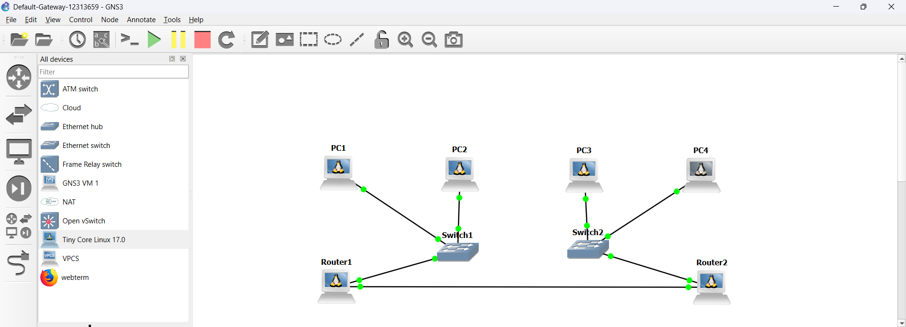
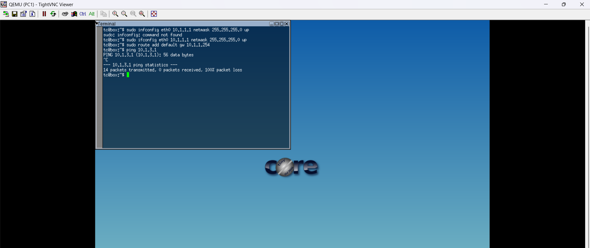
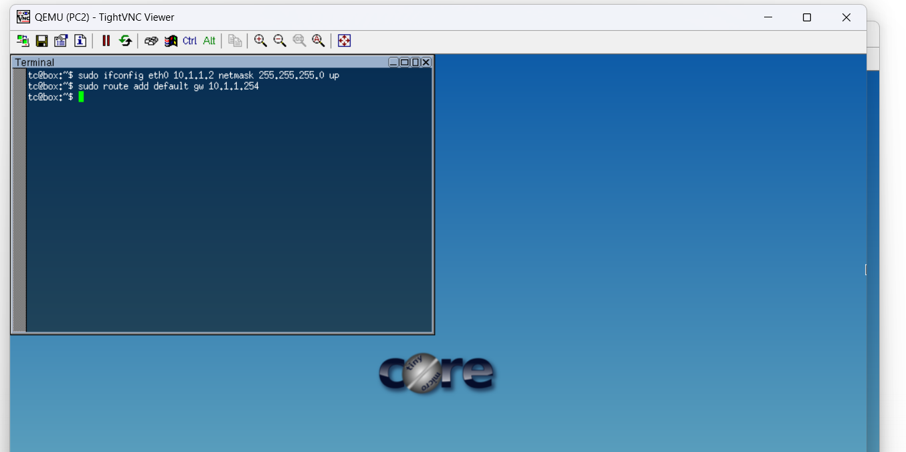
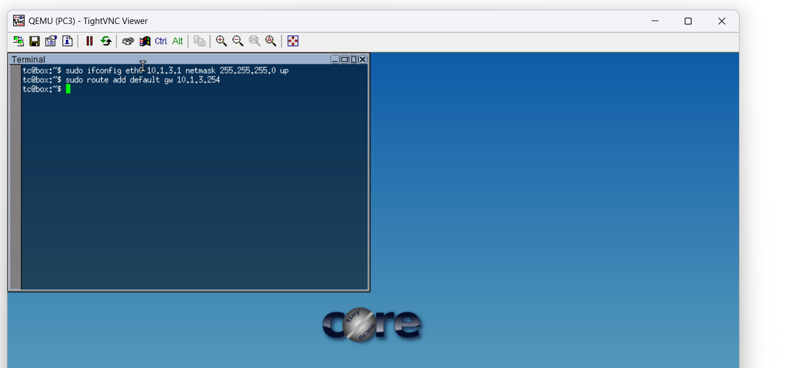
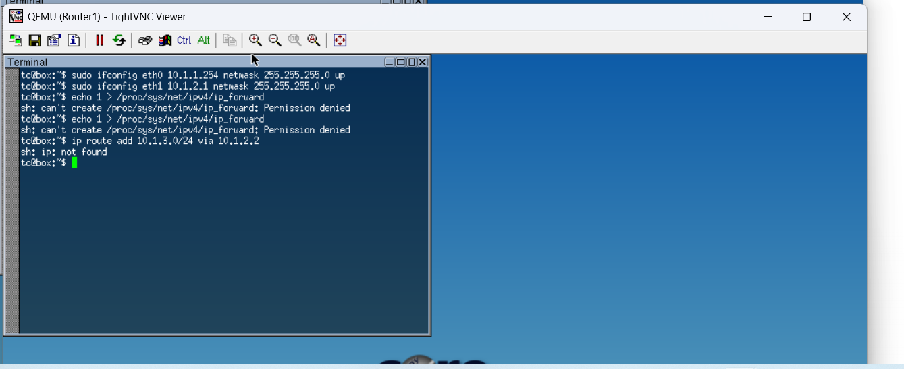
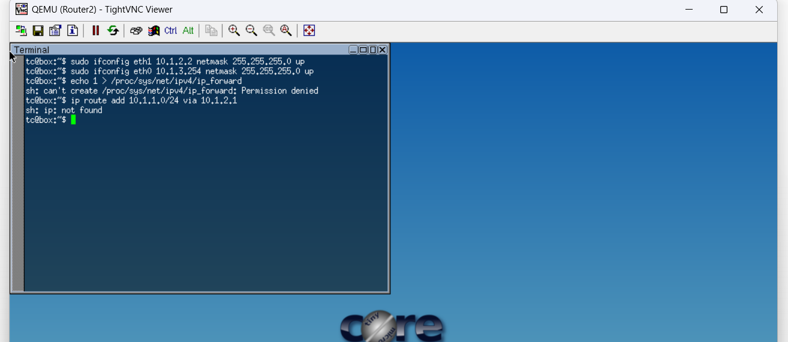

# Week 06 – Task 2: Default Gateway and Inter-Network Routing

## Student Details
- Name: Thrinadh  
- Student ID: 12313659  

---

## 1. Aim

The aim of this task is to configure default gateways and implement inter-network routing in a multi-subnet network using Linux-based routers in GNS3. The objective is to allow communication between hosts located in different networks through proper routing configuration.

---

## 2. Network Topology

This network consists of two separate LANs connected using two routers. Each LAN is connected via a switch, and the routers are connected together to allow communication between networks.

### Topology Explanation

- PC1 and PC2 are connected to Switch1 (Network: 10.1.1.0/24)
- PC3 and PC4 are connected to Switch2 (Network: 10.1.3.0/24)
- Router1 connects Network 10.1.1.0 to 10.1.2.0
- Router2 connects Network 10.1.3.0 to 10.1.2.0
- Router1 and Router2 are connected through Network 10.1.2.0

This setup creates three networks:
1. Left LAN (10.1.1.0/24)
2. Inter-router network (10.1.2.0/24)
3. Right LAN (10.1.3.0/24)

---

## 3. IP Addressing Scheme

| Device   | Interface | IP Address     | Subnet Mask       |
|----------|----------|----------------|-------------------|
| PC1      | eth0     | 10.1.1.1       | 255.255.255.0     |
| PC2      | eth0     | 10.1.1.2       | 255.255.255.0     |
| Router1  | eth0     | 10.1.1.254     | 255.255.255.0     |
| Router1  | eth1     | 10.1.2.1       | 255.255.255.0     |
| Router2  | eth1     | 10.1.2.2       | 255.255.255.0     |
| Router2  | eth0     | 10.1.3.254     | 255.255.255.0     |
| PC3      | eth0     | 10.1.3.1       | 255.255.255.0     |
| PC4      | eth0     | 10.1.3.2       | 255.255.255.0     |

---

## 4. Configuration Steps

### 4.1 Configure PCs

Each PC is configured with an IP address and default gateway.

#### PC1
sudo ifconfig eth0 10.1.1.1 netmask 255.255.255.0 up  
sudo route add default gw 10.1.1.254  

#### PC2
sudo ifconfig eth0 10.1.1.2 netmask 255.255.255.0 up  
sudo route add default gw 10.1.1.254  

#### PC3
sudo ifconfig eth0 10.1.3.1 netmask 255.255.255.0 up  
sudo route add default gw 10.1.3.254  

#### PC4
sudo ifconfig eth0 10.1.3.2 netmask 255.255.255.0 up  
sudo route add default gw 10.1.3.254  

---

### 4.2 Configure Router1

Router1 connects the first LAN and the inter-router network.

sudo ifconfig eth0 10.1.1.254 netmask 255.255.255.0 up  
sudo ifconfig eth1 10.1.2.1 netmask 255.255.255.0 up  

Enable IP forwarding:
sudo sh -c "echo 1 > /proc/sys/net/ipv4/ip_forward"  

Add route to Network 10.1.3.0:
sudo route add -net 10.1.3.0 netmask 255.255.255.0 gw 10.1.2.2  

---

### 4.3 Configure Router2

Router2 connects the second LAN and the inter-router network.

sudo ifconfig eth1 10.1.2.2 netmask 255.255.255.0 up  
sudo ifconfig eth0 10.1.3.254 netmask 255.255.255.0 up  

Enable IP forwarding:
sudo sh -c "echo 1 > /proc/sys/net/ipv4/ip_forward"  

Add route to Network 10.1.1.0:
sudo route add -net 10.1.1.0 netmask 255.255.255.0 gw 10.1.2.1  

---

## 5. Screenshots (Evidence)

### 5.1 Topology

### 5.2 PC Configuration
  
  
  
  

### 5.3 Router Configuration
  
  

### 5.4 Ping Result

---

## 6. Testing and Verification

To test connectivity, a ping was performed from PC1 to PC3.

Command:
ping 10.1.3.1  

### Observed Result

- Packets transmitted successfully  
- Packets received successfully  
- No packet loss  
- Network communication working properly  

This confirms that routing between different networks is correctly configured.

---

## 7. Analysis

The network works successfully due to three important configurations:

1. Default Gateway  
Each PC sends traffic outside its network to the router.

2. IP Forwarding  
Routers are able to forward packets between interfaces.

3. Static Routing  
Routers know the correct path to reach other networks.

Without these configurations, communication between different subnets would not be possible.

---

## 8. Issues Encountered and Solutions

Issue: Ping failed  
Cause: No routing configured  
Solution: Added static routes  

Issue: Permission denied  
Cause: Missing sudo  
Solution: Used sudo command  

Issue: ip command not working  
Cause: Not available in TinyCore Linux  
Solution: Used route command  

---

## 9. Conclusion

In this task, a multi-network environment was successfully implemented using routers and switches in GNS3. By assigning IP addresses, configuring default gateways, enabling IP forwarding, and applying static routing, communication between different subnets was achieved. This task clearly demonstrates the role of routers in connecting multiple networks and ensuring proper data transmission across them.
